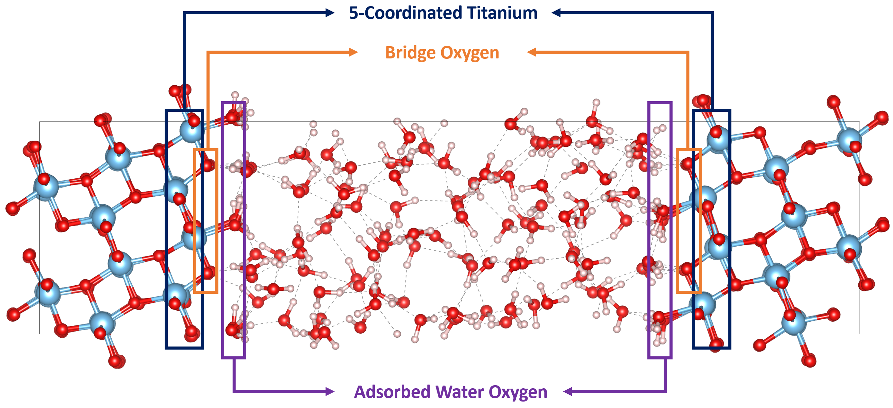

# Interface Structure Analysis

## Mos Interface Identify
Identifying the surface unsaturned metal sites, adsorbed waters and surface bridge oxygens.   
- ```input: structure object (xyz file or MDAnalysis.University)```
- ```output: atomic indices in the structure file (numpy ndarray)```  

### Example: Identify the surface species of anatase/water interface

```python
import numpy as np
import MDAnalysis as mda
from ec_mos_toolkits.interface.mos_interface_identify import surface_identify

file_path = 'anatase-water-init.xyz'
univ_init = mda.Universe(file_path)
interface = surface_identify(atoms=file_path, 
                             cell=[10.247, 15.084, 39.492, 90, 90, 90], 
                             metal_name='Ti', 
                             cutoff_O_H=1.2, 
                             cutoff_O_M=2.8,
                             )
idxs_surface = interface.surface_species()
```
And to get the indices of these atoms,
```python
o_br = idxs_surface.get_O_bridge
o_wat = idxs_surface.get_O_wat
h = idxs_surface.get_H
ti_5c = idxs_surface.get_M_unsatur

print(f'Oxygen-Bridge:\n {o_br}')
print(f'Oxygen-Water:\n {o_wat}')
print(f'Hydrgens:\n {h}')
print(f'Ti-5-Coordinated:\n {ti_5c}')
```
--> output: indices of two sides
```bash
Oxygen-Bridge:
 [[250 251 252 253 254 255 256 257]
 [266 267 268 269 270 271 272 273]]
Oxygen-Water:
 [242 243 244 245 246 247 248 249 258 259 260 261 262 263 264 265 274 275
 276 277 278 279 280 281 282 283 284 285 286 287 288 289 290 291 292 293
 294 295 296 297 298 299 300 301 302 303 304 305 306 307 308 309 310 311
 312 313 314 315 316 317 318 319 320 321 322 323 324 325 326 327 328 329
 330 331 332 333 334 335 336 337 338 339 340 341 342 343 344 345 346 347
 348 349 350 351 352 353 354 355 356 357 358 359 360 361 362 363 364 365
 366 367 368 369 370 371 372 373 374 375 376 377 378]
Hydrgens:
 [  0   1   2   3   4   5   6   7   8   9  10  11  12  13  14  15  16  17
  18  19  20  21  22  23  24  25  26  27  28  29  30  31  32  33  34  35
  36  37  38  39  40  41  42  43  44  45  46  47  48  49  50  51  52  53
  54  55  56  57  58  59  60  61  62  63  64  65  66  67  68  69  70  71
  72  73  74  75  76  77  78  79  80  81  82  83  84  85  86  87  88  89
  90  91  92  93  94  95  96  97  98  99 100 101 102 103 104 105 106 107
 108 109 110 111 112 113 114 115 116 117 118 119 120 121 122 123 124 125
 126 127 128 129 130 131 132 133 134 135 136 137 138 139 140 141 142 143
 144 145 146 147 148 149 150 151 152 153 154 155 156 157 158 159 160 161
 162 163 164 165 166 167 168 169 170 171 172 173 174 175 176 177 178 179
 180 181 182 183 184 185 186 187 188 189 190 191 192 193 194 195 196 197
 198 199 200 201 202 203 204 205 206 207 208 209 210 211 212 213 214 215
 216 217 218 219 220 221 222 223 224 225 226 227 228 229 230 231 232 233
 234 235 236 237 238 239 240 241]
Ti-5-Coordinated:
 [[540 542 560 562 580 582 600 602]
 [523 525 543 545 563 565 583 585]]
```
---
## Surface Proton Counting
building...
