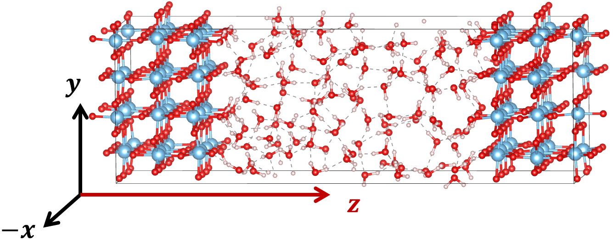

# Calculation Electrostatic Potential (Gaussian Distribution Approximation)

## Electrostatic Potential Calculator
### Introduction
Solving Poisson's equation under periodic boundary condition (PBC) and averaged by frames. (Default: Along z-axis)
$$-\frac{\partial}{\partial z}\phi(z)=\frac{\rho(z)}{\varepsilon_0}$$
- ```input: Trajectory contains charges. For example, DPLR trajectory (Atomic cores associated with Wannier centroids).```
- ```output: Electrostatic potential distribution alone z-axis.```  

### Fundamentals
According to the theories about Maximally Localized Wannier Functions (MLWFs), the spread (spacial variance, essentially) of a Wannier funtion must be optimized to the minimun value to localize a unique charge center:
$$\Omega=\sum_n[\langle r^2\rangle_n-\overline{\mathbf{r}_n^2}]\xrightarrow{Optimize}\mathrm{MLWFs}$$
While the total spatial variance in [𝑥, 𝑦, 𝑧] vector basis is the trace of covariance matrix:
$$\boldsymbol{\Omega}_n=Var(\mathbf{r}_{[x,y,z]})=\mathrm{Trace}\left(\begin{bmatrix}\sigma_{xx}^2&\sigma_{xy}^2&\sigma_{xz}^2\\\\\sigma_{yx}^2&\sigma_{yy}^2&\sigma_{yz}^2\\\\\sigma_{zx}^2&\sigma_{zy}^2&\sigma_{zz}^2\end{bmatrix}\right)=\sigma_{xx}^2+\sigma_{yy}^2+\sigma_{zz}^2$$ 

Isotropic independent 3-D Gaussians are applied to approximate the spatial distribution of WCs or Pseudo Cores:
$$\rho_j^G(x,y,z)=\frac{q_j}{(\sqrt{2\pi\sigma_j^2})^3}e^{-\left[\left(\frac{x-x_j}{\sqrt{2\sigma_j^2}}\right)^2+\left(\frac{y-y_j}{\sqrt{2\sigma_j^2}}\right)^2+\left(\frac{z-z_j}{\sqrt{2\sigma_j^2}}\right)^2\right]}$$

Therefore, the charge density distribution along z-axis is derived by averaging those in x-y plane: 
$$\rho_{j}^{G}(z)=\frac{1}{S_{XY}}\int_{X}\int_{Y}\rho_{z,j}^{G}(x,y,z)\mathrm{d}x\mathrm{d}y=\frac{1}{S_{XY}}\frac{q_{z,j}}{\sqrt{2\pi\sigma_{z,j}^{2}}}e^{-\left(\frac{z-z_{j}}{\sqrt{2\sigma_{z,j}^{2}}}\right)^{2}}$$


Gaussian spread 𝝈: as isotropic independent choice, the covariances are zero, and variances in 3 directions are equal. 
$$Var(\mathbf{r_{3D[x,y,z]}^{G}})=\mathbf{Trace}\left(\begin{bmatrix}\sigma_z^2&&0&&0\\\\0&&\sigma_z^2&&0\\\\0&&0&&\sigma_z^2\end{bmatrix}\right)=3\sigma_z^2$$
$$Var(\mathbf{r_{3D[x,y,z]}^{G}})\approx Var(\mathbf{r}_{[x,y,z]})$$
Therefore the Gaussian spread and the Wannier spread of the atom $j$ satisfy:
$$3\sigma_{z, j}^2\approx\boldsymbol{\Omega}_{n,j}$$
$$\sigma_{z,j}\approx\sqrt{\frac{\boldsymbol{\Omega}_{n,j}}{3}}$$

(To be continued...)